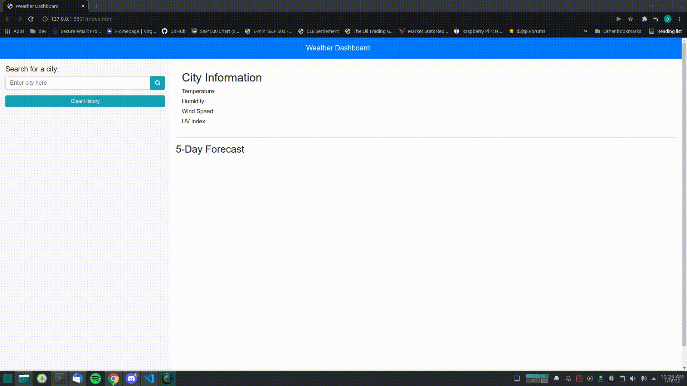

# About The Project:

This is a weather dashboard built with the OpenWeather API. Its key features are that it allows you to search for a city by name and display the most current weather data in the main section. It also displays the UV-Index and a 5 day forecast.

The search history is persistent through refreshes.

# Built With:

- HTML
- CSS
- Javascript

# Getting Started:

In order to run this project you need to click on this link: https://benjamind10.github.io/weather-dashboard/

# Demo:

